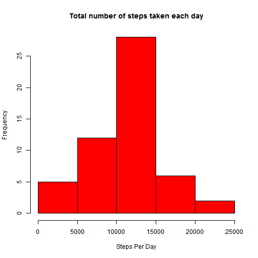
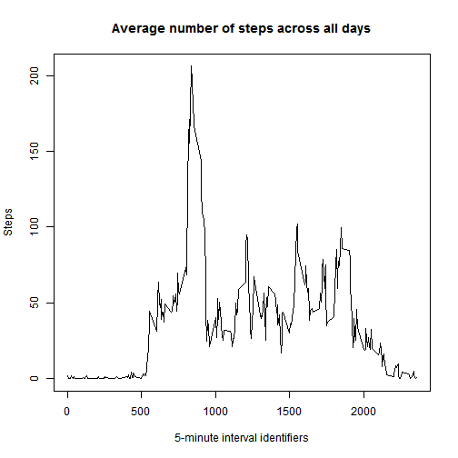
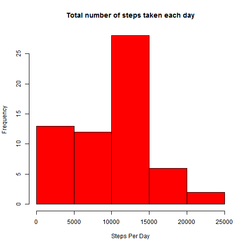
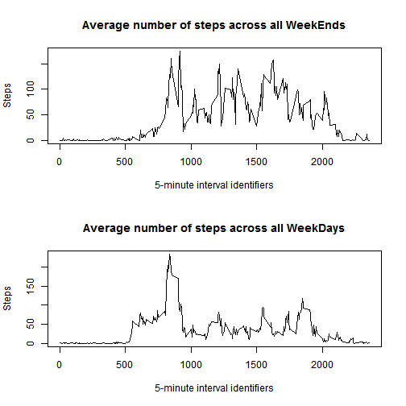

# Reproducible Research: Peer Assessment 1


## Loading and preprocessing the data

```r
#Assume the activity.csv was placed at the same directory as this Rmarkdown file.
dataFrame <- read.csv("activity.csv")
good <- complete.cases(dataFrame[,1])
dataFrame1 <- dataFrame[good,]
```


## What is mean total number of steps taken per day?

```r
#For caculating the total no of steps per day
dataLength <- length(unique(dataFrame1$date))
totalStep <- rep(0,dataLength)
j <- 1
for(i in unique(dataFrame1$date))
{
  totalStep[j] <- sum(dataFrame1[dataFrame1$date == i,1])
  class(i)
  j <- j + 1
}
#Plotting the histogram
hist(totalStep, col="red", main="Total number of steps taken each day", xlab="Steps Per Day")
```

 


```r
options(scipen=999)
meanStep <- mean(totalStep)
medianStep <- median(totalStep)
```

* The __mean__ of number of steps taken per day =  _10766.1887_
* The __median__ of number of steps taken per day =  _10765_

## What is the average daily activity pattern?

```r
dataLength1 <- length(unique(dataFrame1$interval))
totalStep1 <- rep(0,dataLength1)
k <- 1
for(i in unique(dataFrame1$interval))
{
  totalStep1[k] <- mean(dataFrame1[dataFrame1$interval == i,1])
  k <- k + 1
}
#Plot the graph
plot(y = totalStep1, x = unique(dataFrame1$interval), type = "l",xlab="5-minute interval identifiers", ylab="Steps", main="Average number of steps across all days")
```

 


```r
maxi = which.max(totalStep1)
maxiStep <- totalStep1[maxi]
maxiInt <- unique(dataFrame1$interval)[maxi]
```

* On average across all the days in the dataset, __835__ 5-minute interval contains maximum number of steps (_206.1698_ steps)

## Imputing missing values

```r
#The total no of missing values are
missingVal <- sum(is.na(dataFrame$steps))
```

* The total number of missing values in the dataset =  __2304__

Filling all the NA values with 0

```r
#All the NA values are filled with 0
t1 <- as.matrix(dataFrame)
t1[is.na(t1)] <- 0
dataFrame2 <- as.data.frame(t1)

dataLength1 <- length(unique(dataFrame2$date))
totalStep2 <- rep(0,dataLength1)
l <- 1
for(i in unique(dataFrame2$date))
{
  totalStep2[l] <- sum(as.integer(as.character(dataFrame2[dataFrame2$date == i,1])))
  l <- l + 1
}
#Plotting the histogram
hist(totalStep2, col="red", main="Total number of steps taken each day", xlab="Steps Per Day")
```

 


```r
meanStep1 <- mean(totalStep2)
medianStep1 <- median(totalStep2)
```

* The __mean__ of number of steps taken per day =  _9354.2295_
* The __median__ of number of steps taken per day =  _10395_

There is a differnce in both the mean and median.  
These difference arrise beacuse I have assumed NA values to be 0

## Are there differences in activity patterns between weekdays and weekends?


```r
t1 <- (weekdays(as.Date(as.character(dataFrame$date))) == "Sunday" | weekdays(as.Date(as.character(dataFrame$date))) == "Saturday")

dataFrame1 <- dataFrame[t1,]

dataLength2 <- length(unique(dataFrame1$interval))
totalStep1 <- rep(0,dataLength1)
k <- 1
for(i in unique(dataFrame1$interval))
{
  totalStep1[k] <- mean(dataFrame1[dataFrame1$interval == i,1])
  k <- k + 1
}
#Plot the graph
par(mfrow= c(2,1))
plot(y = totalStep1, x = unique(dataFrame1$interval), type = "l",xlab="5-minute interval identifiers", ylab="Steps", main="Average number of steps across all WeekEnds")

dataFrame1 <- dataFrame[!(t1),]

dataLength2 <- length(unique(dataFrame1$interval))
totalStep1 <- rep(0,dataLength2)
k <- 1
for(i in unique(dataFrame1$interval))
{
  totalStep1[k] <- mean(dataFrame1[dataFrame1$interval == i,1])
  k <- k + 1
}
plot(y = totalStep1, x = unique(dataFrame1$interval), type = "l",xlab="5-minute interval identifiers", ylab="Steps", main="Average number of steps across all WeekDays")
```

 
